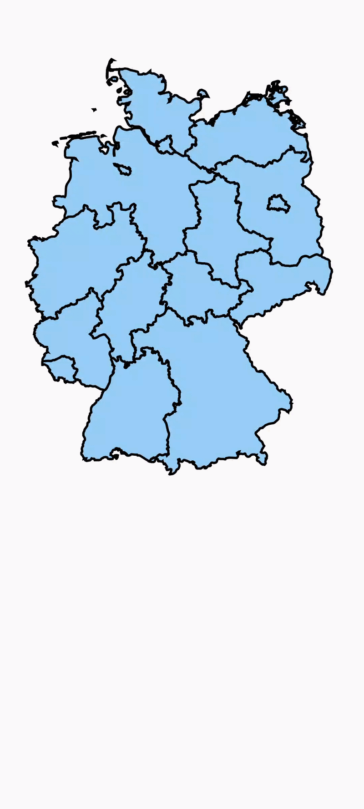

# 🌍 German-Geo-Facts

**Geo-Fact** is an interactive map project built with **Jetpack Compose** that renders geographic regions from **SVG path data** and allows users to interact with them through **touch detection**.

The project demonstrates how to build a **high-performance, fully interactive map using Compose Canvas**, including region hit detection, highlighting, and scalable SVG rendering.

---

# 📸 Screenshots

<p align="center">
  
</p>  

---

# ✨ Features

* 🗺️ Render maps using **SVG path data**
* 👆 **Touch detection** on individual regions
* 🎯 Accurate **path hit testing**
* 🎨 Dynamic **region highlighting**
* ⚡ Optimized rendering using **Jetpack Compose Canvas**
* 📱 Fully built with **Jetpack Compose**

---

# 🎥 Demo


---

# 🏗️ Architecture Overview

Geo-Fact follows a simple architecture designed for **performance and scalability** when working with complex SVG maps.

### 1. SVG Path Parsing

The SVG file is parsed and converted into **Compose Path objects**.

### 2. Canvas Rendering

Each region path is rendered using **Compose Canvas**.

### 3. Touch Detection

When the user taps the screen:

1. Touch position is captured
2. Each region path is checked
3. The touched region is detected
4. The region state updates and highlights

---


### Important Components

**MapCanvas.kt**

Responsible for rendering the SVG paths on the Compose Canvas.

**MapRegion.kt**

Represents each geographic region including:

* region id
* name
* path data
* color / selection state

**HitDetection.kt**

Handles touch detection and determines which region is tapped.

---

# 🚀 Getting Started

### 1. Clone the repository

```bash
git clone https://github.com/nazmos-sakib/German-Geo-Facts.git
```

### 2. Open in Android Studio

Open the project folder using **Android Studio**.

### 3. Run the project

Run the app on:

* Android Emulator
* Physical Android Device

---

# ⚙️ Requirements

* Android Studio Hedgehog or newer
* Kotlin
* Jetpack Compose enabled
* Minimum SDK: 24+

---

# 🧩 Usage Example

Example of using the map component:

```kotlin
MapCanvas(
    regions = mapRegions,
    onRegionClick = { region ->
        println(region.name)
    }
)
```

---

# 🎨 Customization

Geo-Fact is designed to be easily customizable.

You can:

* Replace the SVG map
* Change region colors
* Add tooltips or labels
* Implement zoom and pan
* Add animations

---

# ⚡ Performance Considerations

Large SVG maps can contain hundreds of paths.
Geo-Fact uses several optimizations:

* Path caching
* Efficient hit detection
* GPU-accelerated rendering via Compose Canvas
* Avoiding unnecessary recompositions

---

# 🔮 Future Improvements

Planned features for the project:

* [ ] Zoom and pan support
* [ ] Region labels
* [ ] Map animations
* [ ] Multi-touch gestures
* [ ] Better hit detection optimization
* [ ] Dynamic map loading

---

# 🤝 Contributing

Contributions are welcome!

Steps:

1. Fork the repository
2. Create a feature branch
3. Commit your changes
4. Push to your fork
5. Open a Pull Request

---

# 📄 License

This project is licensed under the **MIT License**.

---

# 🙏 Acknowledgements

* Open-source SVG map datasets
* Jetpack Compose documentation
* Android developer community
